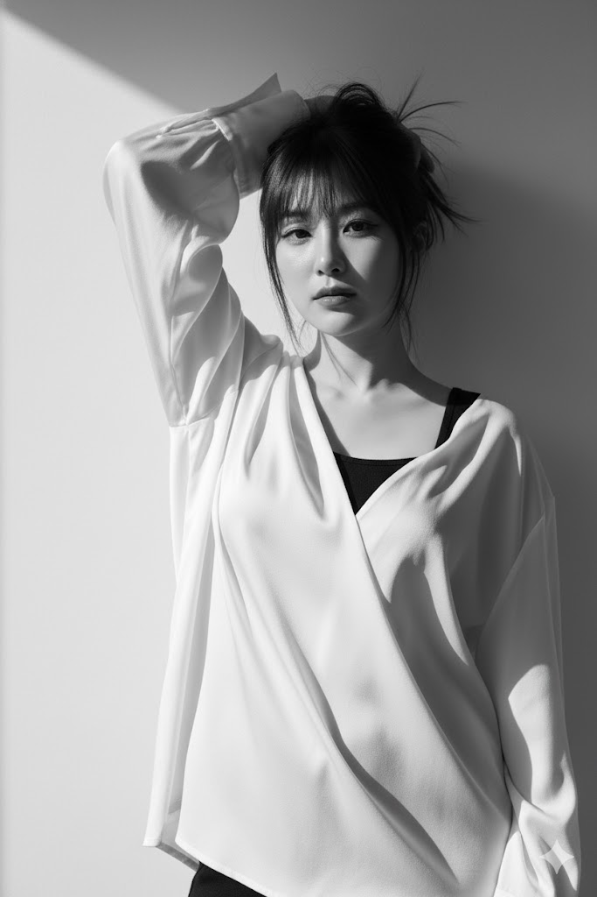

# Prompt Library (提示词库)

欢迎来到提示词库！这个仓库收集了各种高质量的提示词（Prompts），旨在帮助你更好地使用生成式AI工具，会持续更新。

##  目录 (Contents)

- [Text to Image (文生图)](#text-to-image-文生图)
- [Image to Image (图生图)](#image-to-image-图生图)

---

## Text to Image (文生图)

这里收集了用于生成高质量图像的提示词。

模型推荐： [Wang](https://create.wan.video/), [Grok](https://grok.com/), [即梦AI](https://jimeng.jianying.com/ai-tool/home/)

### 1. Candid Charm: The Playful Gaze (抓拍，俏皮的凝视)

**分类 (Category)**: Hyper-realistic Lifestyle Photography (超写实生活摄影)  
**基调 (Tone)**: Charming, Raw, Youthful, Candid (迷人、原始、年轻、坦率)

> **描述**: 这张照片展示了一位年轻亚洲女性在露台上蹲着的抓拍瞬间，她回眸看向镜头，眼神俏皮而无辜。

**[查看详细 Prompt (JSON)](text-to-image/prompt_1.json)**

### 2. High Fidelity Photorealism (换装，自拍)

**分类 (Category)**: Korean Street Fashion / Mirror Selfie (韩系街头时尚 / 对镜自拍)  
**基调 (Tone)**: Soft, Muted, High-End (柔和、低饱和、高端)

> **描述**: 一位时尚博主在服装店的超写实对镜自拍，身穿荷叶边大衣和过膝长靴。

**[查看详细 Prompt (JSON)](text-to-image/prompt_2.json)**

---

## Image to Image (图生图)

这里收集了用于图像到图像生成的提示词。

模型推荐： [Gemini (Nano Banana)](https://gemini.google.com/)

### 1. High-Fashion Editorial Portrait (高级时尚杂志人像)

**分类 (Category)**: High-Fashion Editorial / Monochrome (高级时尚杂志 / 黑白)  
**基调 (Tone)**: Dramatic, Artistic, Intense (戏剧性、艺术、强烈)

> **描述**: 黑白高级时尚杂志人像，具有戏剧性的光影和强烈的凝视。

**[查看详细 Prompt (TXT)](image-to-image/prompt_1.txt)**

### 2. character design sheets (角色设计)

**分类 (Category)**: Character Design Sheets / Concept Art (角色设计图 / 概念图)  
**基调 (Tone)**: Detailed, Professional, Artistic (详细、专业、艺术)

> **描述**: 全景式角色深度概念分解图

**[查看详细 Prompt (TXT)](image-to-image/prompt_2.txt)**

